# tbp：基于标签的本地资源管理软件（用于知识库管理）


- 软件提供基本的本地文件新增、修改、删除、打开功能，可以通过拖拽的方式与操作系统原生的资源管理器进行交互

- 软件支持插件扩展，可以通过插件的方式丰富软件功能
  - 通过插件，支持url的本地化存储
- 软件为每个纳入管理的文件添加了额外的标签信息，可以通过标签快速检索定位文件
  - 标签只是最普通的字符串，可以很轻易的修改单个文件的标签，也可以批量重命名标签
  - 可以预定义标签结构，从而快速检索文件，快速为文件添加标签
  - 软件启动后，会将标签信息加载到内存中，因此检索非常快速
- 所有的数据都存储在本地
- 开发者自用软件，目的是进行知识库管理，会持续更新（频率无法保证）

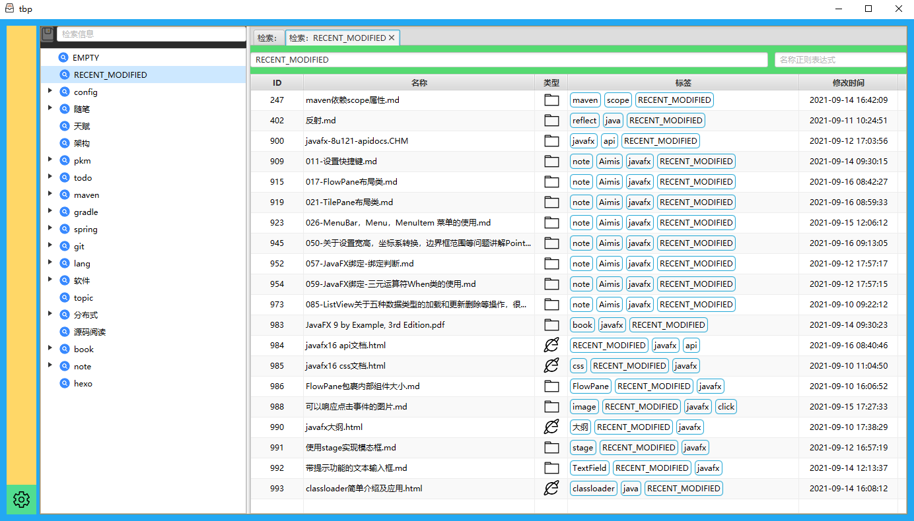

## 简介

- 受  [dendron](https://github.com/dendronhq/dendron) 这个项目的启发，感觉 基于标签的笔记管理软件 挺有用
  - 但是这个是基于VSCode的，受限于VSCode，也不是自己的技术栈
    - 对文件内容有入侵
    - 要使用VSCode作为编辑器
      - 万一想要用别的编辑器呢？比如Typora、羽雀、OneNote啥的
  - 而且直接使用标签作为文件名，感觉也不太合适
    - 有意义的文件名可以帮助筛选数据，而且本地文件一般少见直接用标签做名字的
- 自己觉得挺需要类似的东西来进行知识管理
- 刚好学了网络、IO相关的知识，具备基本的实现条件
- 但是不打算做一个笔记软件
  - 一是自己没有能力做
  - 二是没有必要，各种各样的笔记软件已经够多了，萝卜白菜各有所爱，自己也换了好几款
- 打算不管编辑这块儿，专注于数据的组织管理，将标签作为核心元数据，实现一个资源管理软件，可以管理本地资源，也可以管理网络资源
  - 最开始基于JavaWeb进行实现，使用spring boot提供web接口，layui绘制页面，picocli实现命令行，元数据组件作为独立的tcp服务器，处理web接口和命令行操作。
  - 但是自己前端能力并不强，做出来的页面还是类似一般的web系统，使用体验其实不好，想要自定义功能又不会实现
  - 最后学习了B站UP的[javafx系列教学视频](https://space.bilibili.com/5096022/channel/detail?cid=16953&ctype=0)，使用javafx进行客户端开发，更加贴近原生软件的使用体验
  - 重构了原本的代码，将元数据管理逻辑和文件操作分离，方便后续的扩展
- 总之，做着做着发现自己实际上算是做了本地资源管理器
- 后续的开发方向
  - 优化软件使用体验，更加易用
  - 随着个人知识管理理念的完善，提供对应的功能


## 使用

需要本地安装 git、java11、maven。

目前还没有在mac上进行测试


### 打包

```shell
# 拉取代码
git clone https://gitee.com/sayYi/tag-based-pkm.git

# 进入根目录
cd tag-based-pkm
# 执行打包命令
mvn clean package

# 获取软件
cd tbp-assembly/target
```


- 将代码拉取到本地，切换到master分支

- 进入项目根目录，执行maven命令

  - maven clean package

- `tbp-assembly` 模块target文件夹下的tar.gz文件即为打包后的软件

- 将tar.gz文件复制到合适的位置并解压缩

  - 文件结构

  - ```
    bin		软件启动命令
    conf	软件配置文件
    lib		软件依赖的jar文件
    plugin	软件插件
    ```

### 启动

- 修改配置文件

  - 进入软件的conf文件夹，修改`tbp.cfg`配置文件内容

    - ```properties
      # 元数据存储路径
      snapDir=C:\\Users\\71734\\Desktop\\temp\\real-tbp-data\\snap
      # 文件存储路径
      storeDir=C:\\Users\\71734\\Desktop\\temp\\real-tbp-data\\store
      ```

    - 软件会存储两种数据

      - 元数据：包括文件标签、标签树、元数据版本等
      - 文件：文件夹、md文件、图片、txt文件等

- 启动

  - 进入软件的 bin 文件夹，调用 tbpClient 命令，即可启动软件


### 页面简介 

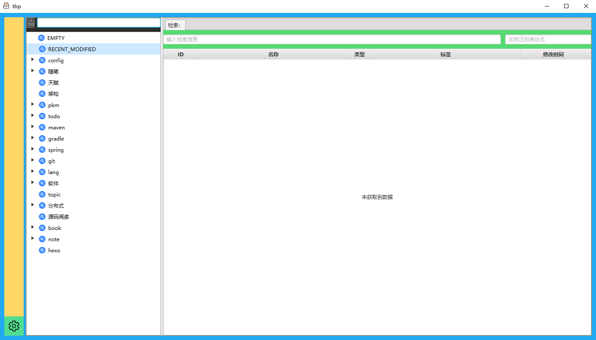

- 最左侧（黄色区域）
  - 预留的插件栏，可以通过插件机制添加插件
- 中间（树）
  - 预定义的标签树
    - 提供树的常见功能，创建、移动子节点等等
    - 快速查询数据、快速添加标签
  - 调整标签树种的标签，不会影响文件绑定的标签数据
  - 目前只是作为预定义结构，提供快速查询、快速添加标签的能力，后边会详细介绍使用
- 最右侧（tab栏）
  - 默认打开标签检索tab
    - 通过标签、文件名的方式查询文件
    - 可以进行文件的新增、修改、删除等操作
    - 可以通过插件扩展可以执行的文件操作


### 基本使用


#### 添加数据

> 注意：为了简化新建的流程，所有新建的文件会自动携带当前页面对应的**检索标签**

- 新建
  - 新建文件
    - 
    - 在检索tab页中，右键，选择 “新建文件” 选项，即可创建文件。默认创建md文件
      - 这就是个空白文件，可以随意修改后缀，比如改成txt
    - 文件新建后，可以在input框中调整文件名
  - 新建文件夹
    - 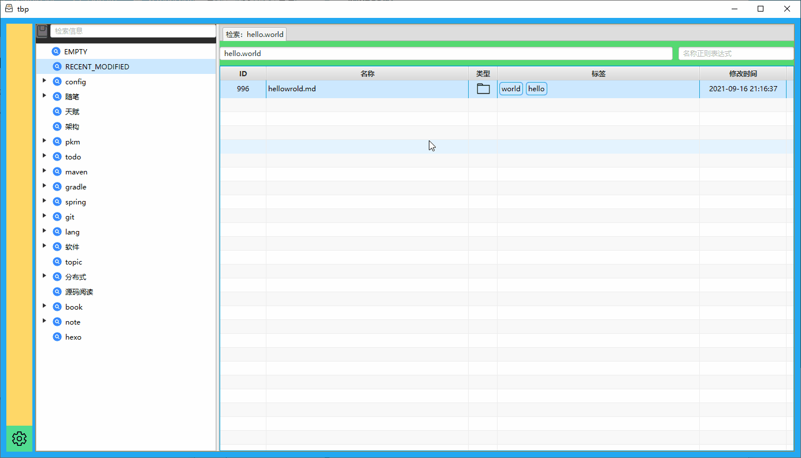
    - 与新建文件类似操作，只不过创建的是文件夹
  - 添加url
    - 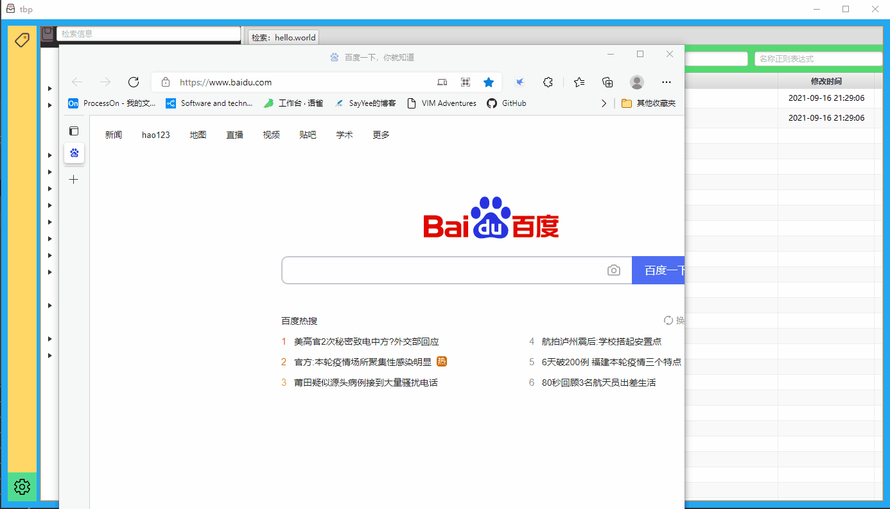
    - 复制要添加的url
    - 在tab中右键，选择 粘贴url，选择刚刚复制的url地址
    - 软件会创建一个可以跳转目标url的html文件
    - 这个功能是通过插件实现的

- 拖拽
  - 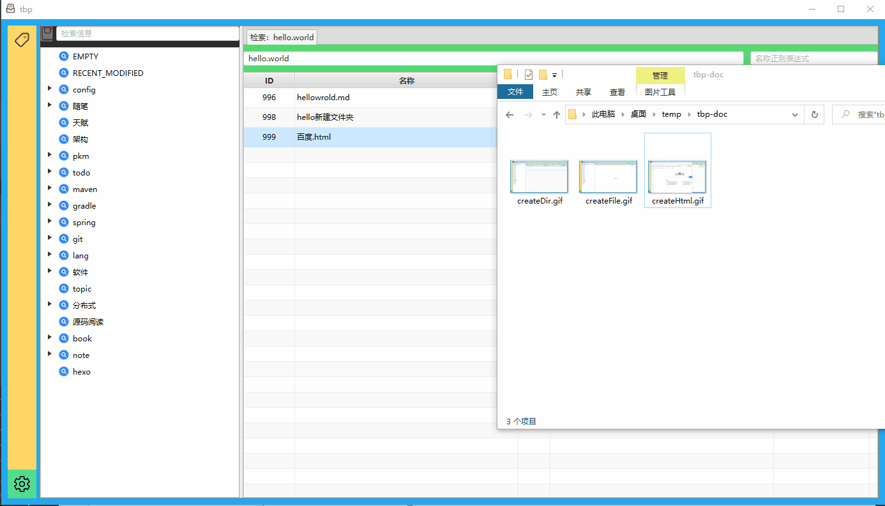
  - 直接将文件拖拽进去即可


#### 打开文件

直接双击，或者通过右键菜单 “打开” 都可以

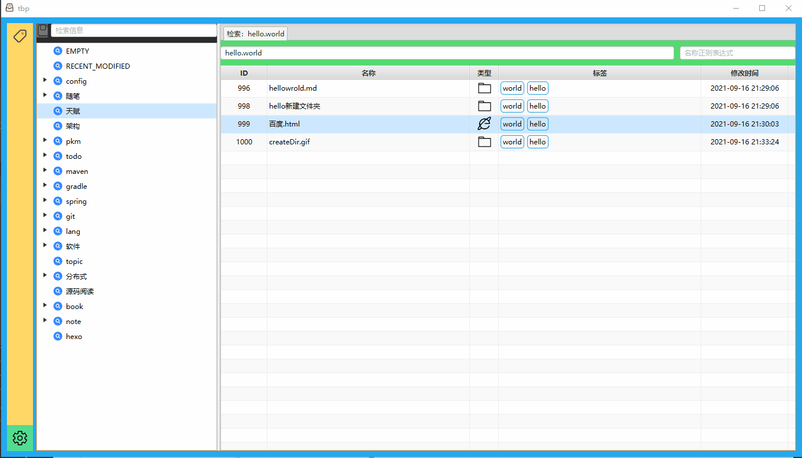

#### 编辑文件

- 编辑文件名
  - 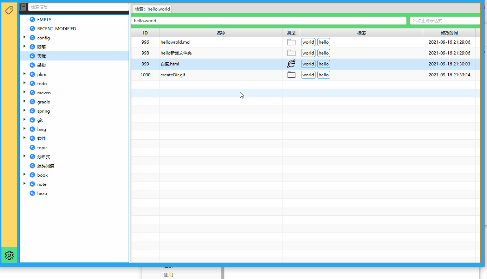
  - 单击文件名两次，即可编辑，enter确认，esc取消
- 编辑标签
  - 直接编辑
    - 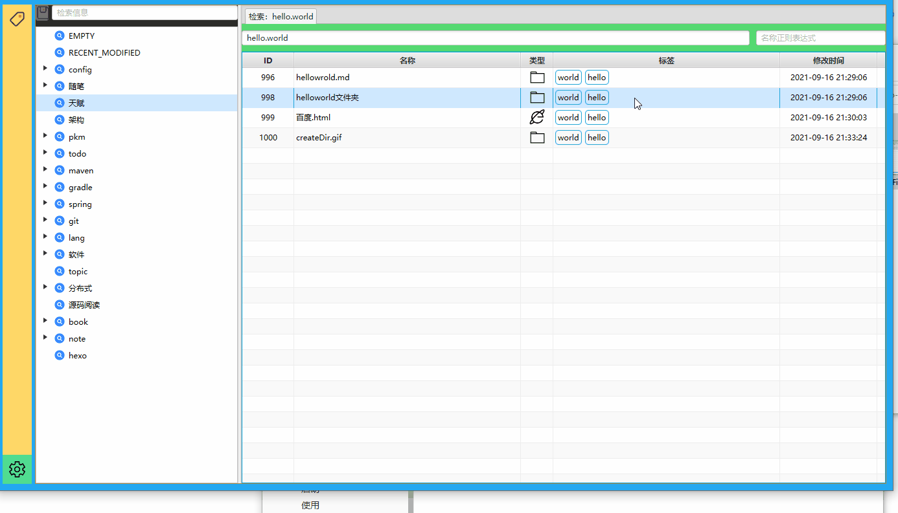
    - 单击标签栏两次，即可编辑，enter确认，esc取消
    - 不同标签使用`.`分隔
  - 拖拽编辑
    - 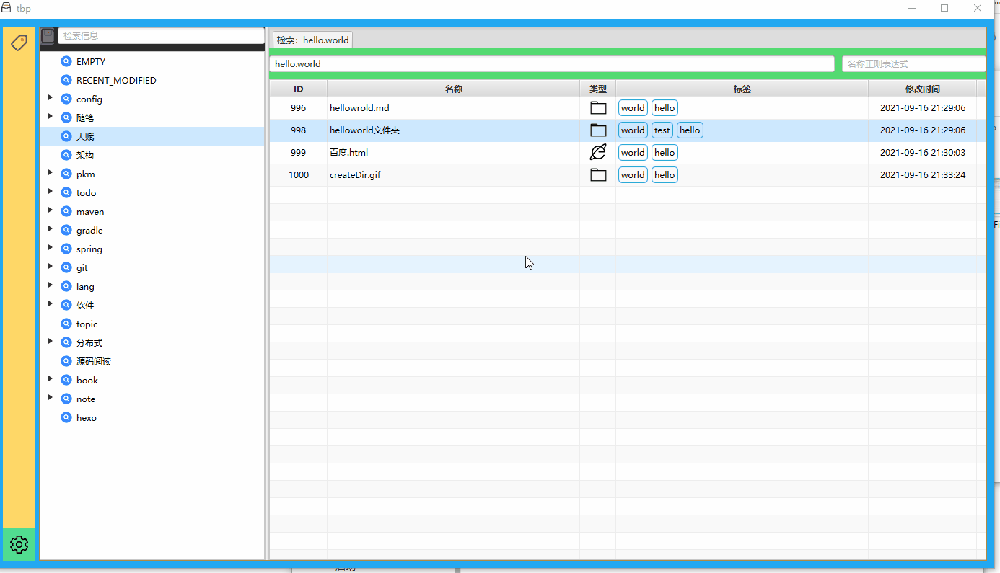
    - 直接从中间的tree组件拖拽标签，放在对应的条目上也可以
    - 如果拖拽树的子节点，会连带将父节点也拖拽过来


#### 删除文件

- 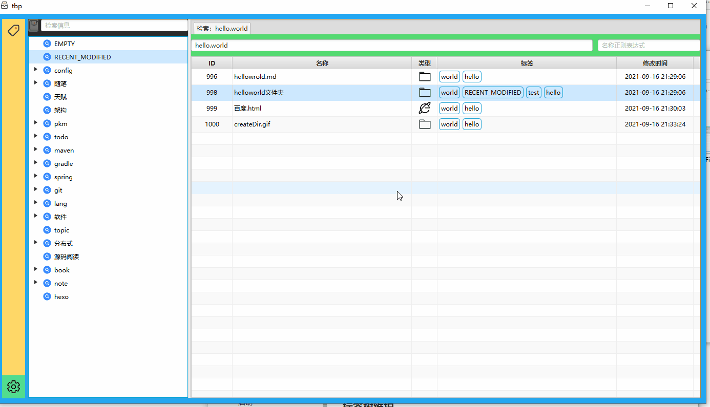
- 通过右键菜单直接删除，会删除对应的元数据和文件


#### 查询文件

通过tab页中的输入框，输入想要搜索的tag，软件会自动提示有哪些匹配标签以及每个标签对应的文件数量，**enter**选择相应检索的标签，然后再次enter即可检索数据

> 这个提示框自己做的，稍微有点小问题。只有在提示框关闭的情况下，才能在检索框输入enter进行检索

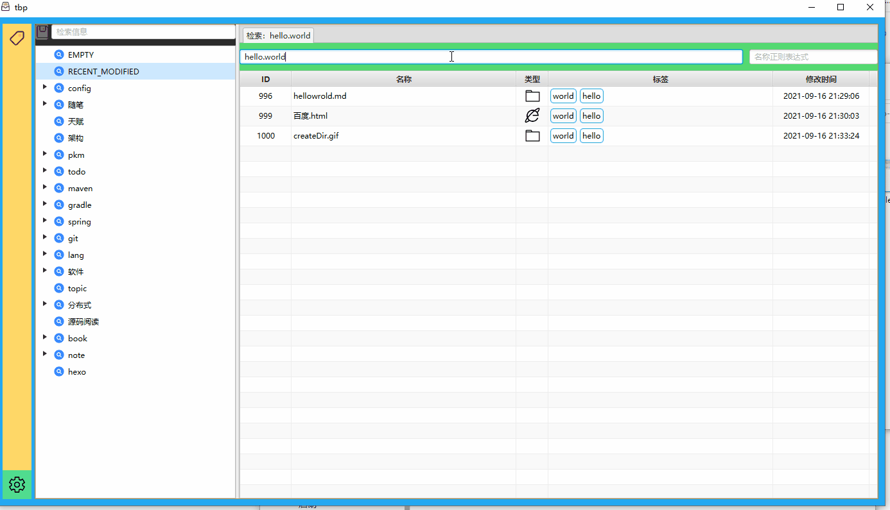


#### 标签树


- 直接拖动，调整位置、层级
- 支持新建、修改、删除节点操作

> 注意：修复标签树后，一定要点击上方的保存按钮，不然变更不会被修改

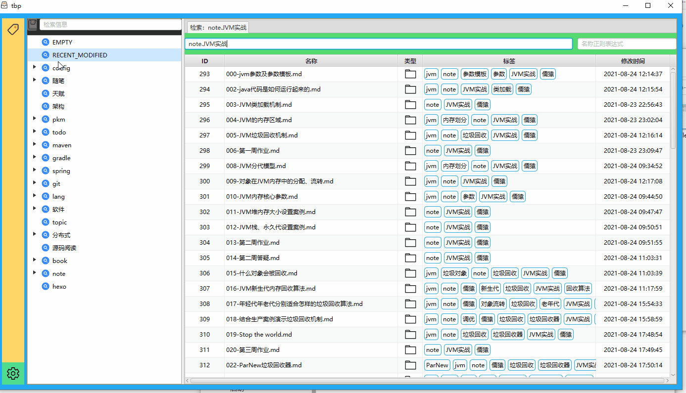

- 可以直接点击标签左侧的小图标，快速检索数据

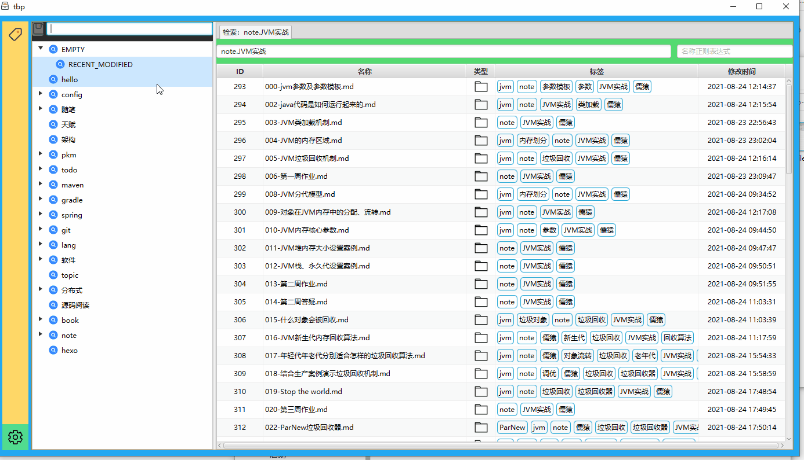


#### 标签重命名

- 通过左侧的标签插件，可以批量重命名标签

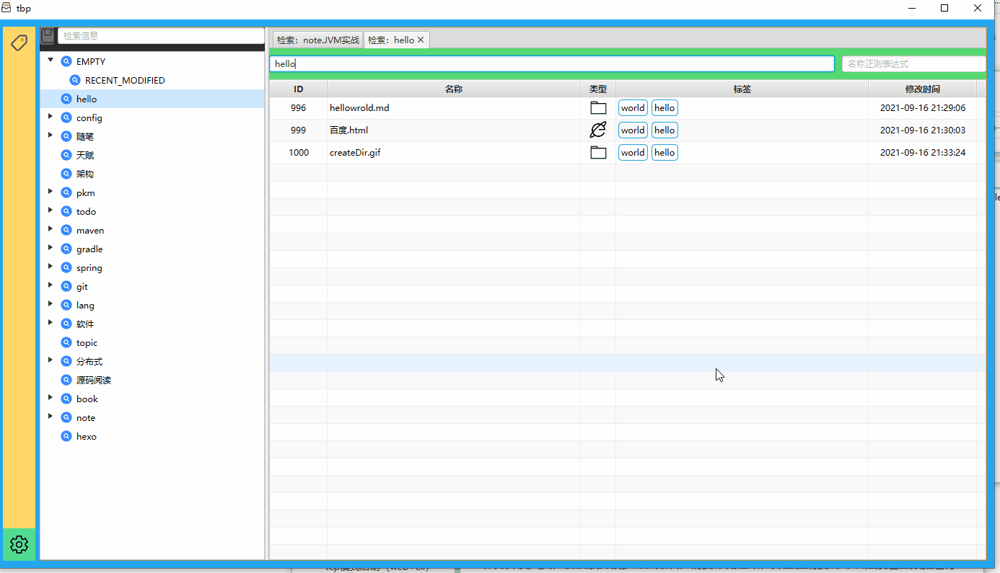


#### 其他

- 双击tab栏上边，可以新建一个空白的检索tab

### 数据同步

- 软件所有的数据都存储在本地，目前并不支持同步到其他的设备，建议使用其他的软件来实现
  - 个人使用的坚果云，多设备同步元数据文件和资源文件


## 代码介绍


### 核心数据结构

```java
public class FileMetadata {

    /**
     * 文件id
     */
    private long id;
    /**
     * 文件名称
     */
    private String filename;
    /**
     * 资源类型，会影响资源的操作方式。1：普通的本地资源；2：持久化到本地的url资源
     */
    private int resourceType = 1;
    /**
     * 资源路径。如果是本地文件，则是相对路径；如果是网络资源，则是链接地址
     */
    private String[] resourcePath;
    /**
     * 标签集合
     */
    private Set<String> tags;

    /**
     * 创建时间戳
     */
    private long createTime;
    /**
     * 最后一次打开时间戳。
     */
    private long lastOpenTime;
}
```


### 模块介绍

tbp-common：javabean、常量类等

tbp-db-api：元数据数据库组件api

tbp-db：元数据数据库，提供持久化、查询等操作

tbp-ui-api：javafx客户端api

tbp-client：javafx客户端

tbp-plugin-tags：标签批量修改插件

tbp-plugin-url：url资源持久化插件

tbp-assembly：打包模块

tbp-generator：自定义dsl解析及代码生成组件


### 插件开发

不同的插件使用不同的类加载器，因此不用担心相互之间会有冲突

- 依赖

  - 必须需要添加两个依赖

  - ```xml
        <dependencies>
            <dependency>
                <groupId>com.sayyi.software</groupId>
                <artifactId>tbp-ui-api</artifactId>
                <scope>provided</scope>
            </dependency>
            <dependency>
                <groupId>org.openjfx</groupId>
                <artifactId>javafx-controls</artifactId>
                <scope>provided</scope>
            </dependency>
        </dependencies>
    ```

  - 如果需要添加其他的依赖也可以直接放里边

- 配置

  - 需要在resource文件夹中放置`project.properties`文件

  - 配置文件中使用参数`mainClass`声明入口类：示例

    - ```
      mainClass=com.sayyi.software.tbp.plugin.url.UrlPlugin
      ```

  - 这个类必须继承自`com.sayyi.software.tbp.ui.api.Plugin`，实现`init`方法

- 代码编写

  - 入口类的`init`方法会被反射调用，并传入两个参数
    - DbHelper：负责与元数据数据库进行交互，通过这个组件执行的更新操作将会被自动持久化，避免丢失
    - UiHelper：负责与javafx客户端页面交互，可以添加侧边栏图标、向tab区域主动添加tab、为检索页右键菜单添加新的菜单项


## 升级

系统升级时，可能修改数据格式，因此每次升级之前，需要提前处理元数据。

1. 使用原版本，重启一次服务端。这会将request文件中的增量数据添加到全量快照文件中。
2. 备份snap中的元数据。主要是避免升级失败，需要重新恢复数据。
3. 删除snap中的request文件。
4. 使用新版本启动。系统会自动将全量数据的格式升级成新版数据，之后就可以正常使用了。


## 使用心得

工具终究是辅助，最重要的还是自我在过程中的收获。在使用这个过程中，用户需要自己来提取文件的核心内容，用标签作为载体进行记录。用户需要自己决定使用哪些标签，每个标签代表何种含义。随着用户自己的经验增长，会发现原有设计不合适的地方，这个修改的过程应该是成长过程中的常态，在基于标签的检索系统中，标签只是一串字符串，修改起来非常容易，不需要有太大的心理压力。

基于标签还有一个好处，应该是用户可以更加容易针对某些主题进行研究，比如对 心跳机制 感兴趣，那么可以通过这个标签，获取所有涉及 心跳机制 的文件资源。

左侧的标签虽然是树状的，但是仅仅只是展示形式，标签之间的关系应该是平等的。

除了主动检索文件之间的联系，我还希望能够有被动一点的方式，比如通过图形来展示标签之间的联系。但是具体怎样还是在探索过程中。

经验的丰富是一个主动的过程，离不开主动的思考，想要借助某个工具一劳永逸是不现实的，还是要自己多思考、多尝试。

这个系统的核心在于用户主动提炼文件的标签信息，然后根据这些信息来查阅文件。文件应该使用什么标签来进行提炼，检索时选择哪些标签，是使用系统的核心。标签体系的建立，需要用户自己主动思考，系统只是帮助方便的达成目的。用户不应该被系统的功能所束缚，如果在使用过程中有任何问题，欢迎给出意见、建议。

