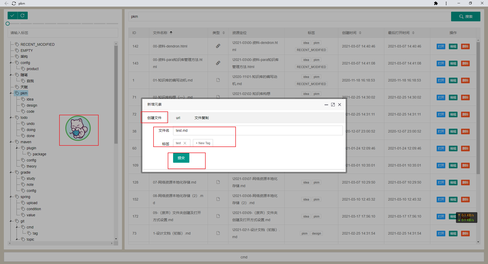
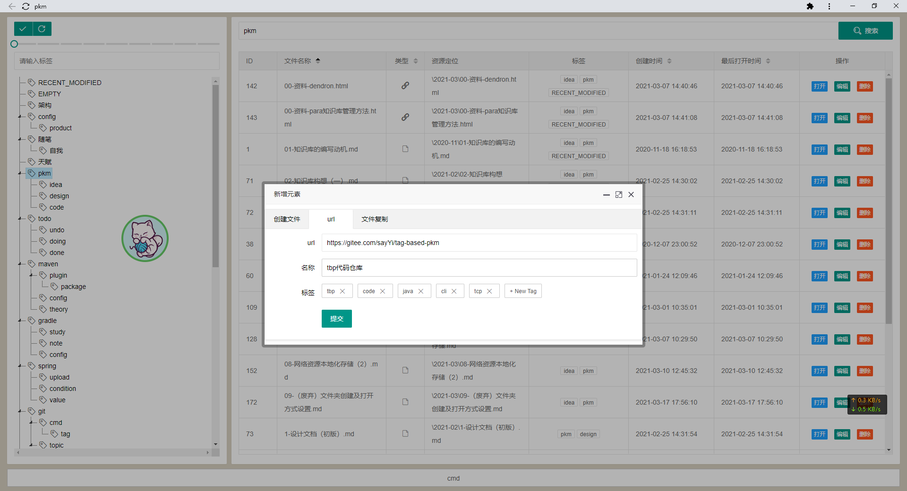
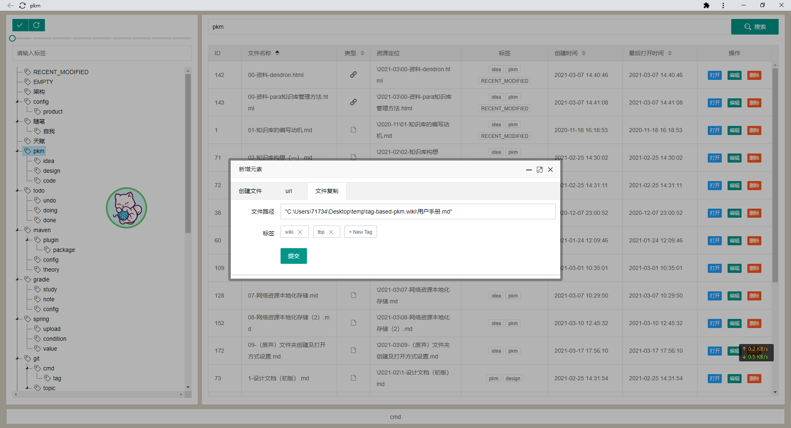
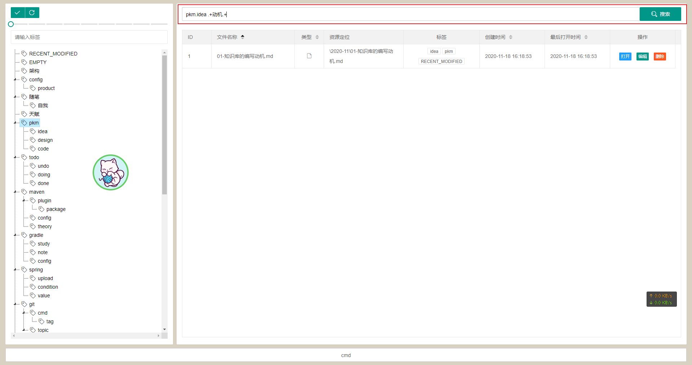
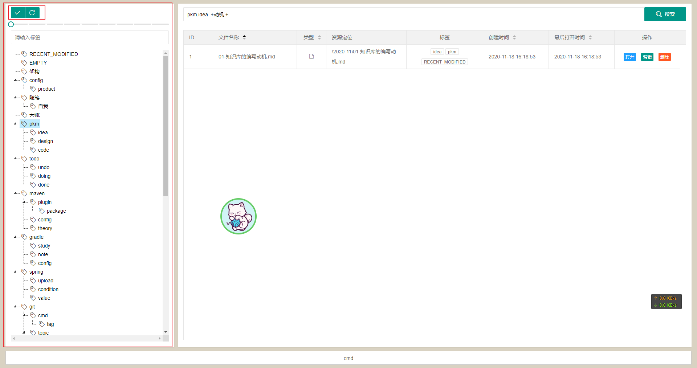
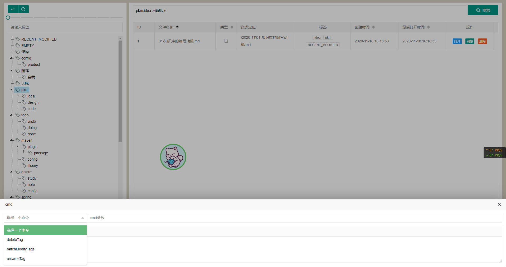

# 关于标签

目标标签中不允许出现`.`点号和` `空格，系统会根据这两个符号进行特殊处理。


# 文件纳入管理

将文件资源纳入tbp系统。理论上而言，系统可以支持各种类型文件的管理，包括文件、文件夹、url。

系统共提供了三种途径：

1. 直接通过tbp创建文件；
2. 将url纳入管理；
3. 将已有文件纳入系统管理。

所有操作都是通过点击悬浮球执行。


## 直接创建文件

点击悬浮球，选择 创建文件 选项卡，填写文件名、标签字符串，点击提交即可

> 文件创建，使用的是java的 java.nio.file.Files#createFile 方法创建出来的




## url

点击悬浮球，选择 url 选项卡，添加url、名称、标签，点击提交

> url会被转换成html文件存储在本地，这样有两个好处：1、离开系统url仍然可用；2、避免太长的url占用元数据空间




## 文件复制

点击悬浮球，选择 文件复制 选项卡，输入文件路径、标签，点击提交

> windows下，可以通过shift+右键的方式复制文件路径
>
> mac下，在文件位置打开命令行，输入
>
> ```
> ls `pwd`/*
> ```
>
> 





# 文件检索

右上角的输入框为搜索框，输入搜索内容后敲击回车或者点击 搜索 按钮，即可执行搜索

检索格式为

```
标签.标签.标签 文件名正则表达式
```

检索检索包含指定标签，并且文件名正则表达式的文件

标签串和文件名表达式，使用空格分隔，两者均为空时展示所有数据。

示例：

```
# 检索带有pkm、idea标签的文件
pkm.idea

# 检索带有pkm、idea标签，并且文件名中包含 动机 的文件
pkm.idea .+动机.+

# 检索文件命中包含 动机 的文件
 .+动机.+
```





# 文件操作

在文件列表中可以对文件进行各种操作。


## 双击打开

双击列表，可以使用本地默认的软件打开文件。

比如md文件会用md编辑器打开，html会被浏览器打开


## 打开按钮

打开文件所在位置，并选中


## 编辑

调整文件元数据信息：名称、标签


## 删除

删除本地文件，删除对应的元数据


# 标签树维护

左侧为标签树区域。

标签树主要是用户记录自己经常使用的标签信息，点击对应的节点会在右侧列表区域进行检索。

对标签树进行修改，并不会影响文件元数据，不会影响绑定的标签。标签树主要是起到一个辅助作用，记录常用标签进行检索。


通过右击节点，可以对节点进行增删改查的操作。通过拖拽可以调整节点层级。每次修改完标签树，需要点击左上角的`√`按钮进行保存，如果要放弃本次修改内容，可以点击`√`旁边的刷新按钮。




# 标签批处理


底部为标签批处理功能区域，点击`cmd`即可展开，目前支持3个命令：删除、批量修改、重命名标签。选择指定的命令，即可展示需要输入的参数信息，敲击回车执行。





